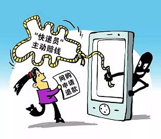
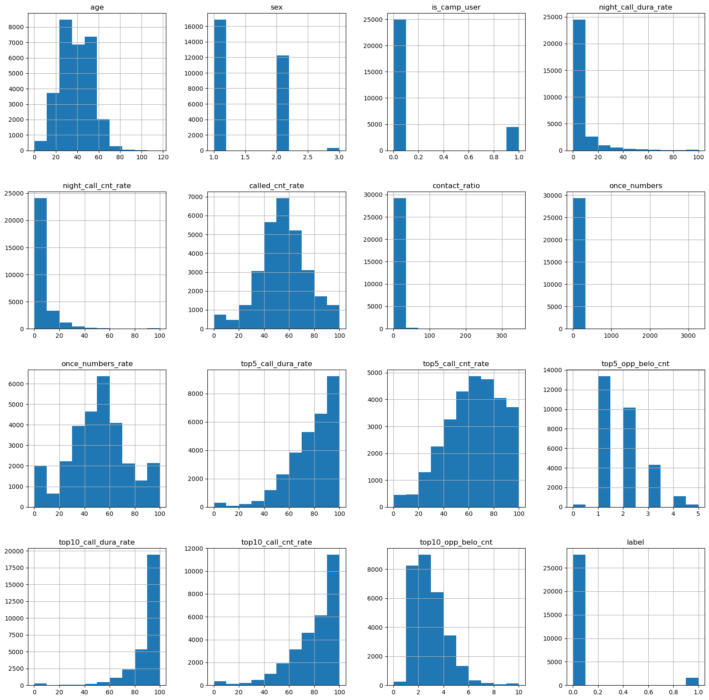
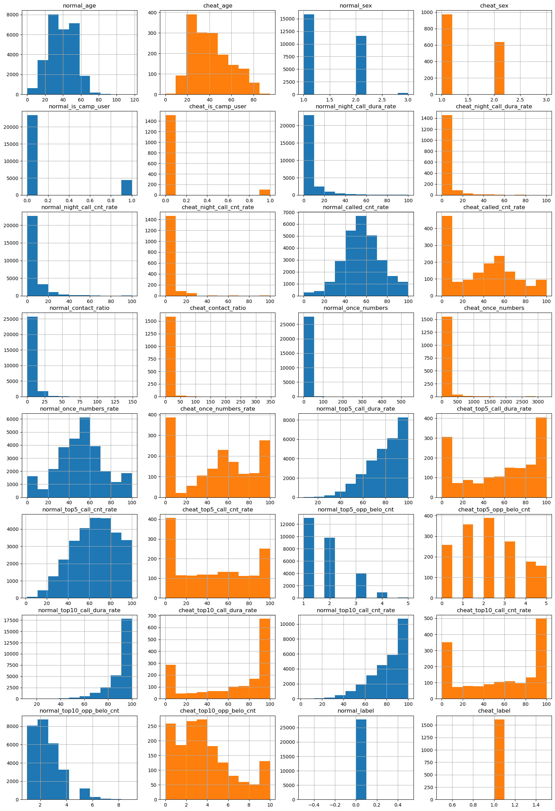
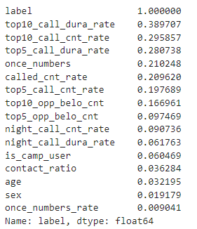

# 电信诈骗预测

## 1 问题分析
- 目标：利用个人基本信息和通话特征，预测用户是否为电信欺诈用户

- 任务类型：有监督的二分类任务

- 潜在的问题：样本标签不均衡    
应对措施：
    1. 验证集的划分；
    2. 评估指标的选择；

- 评估指标：
    1. F-beta-score：考虑到任务本身的性质，我们需要低精度、高查全率，因此设置beta为2，使得查全率的影响高；
    2. P-R曲线：由于ROC曲线仅考虑分类器本身的好坏，并不会考虑样本标签分布不均衡的情况；相反P-R曲线则受样本标签分布影响较大，考虑任务本身的性质，选择P-R曲线作为评估指标；
    3. Precision（辅助）；
    4. Recall（辅助）；
    5. AUC（辅助）；

## 2 研究数据(train.csv)
### 2.1 查看总体数据分布

### 2.2 对比正常用户与欺诈用户的分布差异

### 2.3 特征相关性分析
1. 查看各特征与label的相关系数的绝对值:  

2. 
### 2.3 结论
- 夜间通话时长/次数占比指标分布相似（相关性较高），考虑进行特征处理；
- top10的通话时长占比分布和次数占比分布相似，top10的通话时长占比分布与top5相似，但次数占比分布相似与top5不相似，考虑特征处理；
- 划分验证集时标签分层

- 被呼叫次数偏低的那一部分是欺诈用户的可能性高；
- 仅拨打一次电话的数量比例分布呈现“W”形状，分布两头的部分可能是欺诈用户；
- 仅拨打一次电话的数量高于100的可能是欺诈用户；
- 联系人top5/10 通话时长占比(%)：较低那头是欺诈用户的可能性高;
- 联系人top5/10 通话次数占比(%)：较低那头是欺诈用户的可能性高;
- 联系人top5/10 号码归属地数量：归属地数量多的那部分是欺诈用户的可能性高;

