# 电信诈骗预测

## 1 问题分析
- 目标：利用个人基本信息和通话特征，预测用户是否为电信欺诈用户

- 任务类型：有监督的二分类任务

- 潜在的问题：样本标签不均衡    
应对措施：
    1. 验证集的划分；
    2. 评估指标的选择；
    3. 模型层面决定选择bagging、boosting类模型
    4. 数据层面的过采样、欠采样等方法暂不考虑

- 评估指标：
    1. F-beta-score：考虑到任务本身的性质，我们需要低精度、高查全率，因此设置beta为2，使得查全率的影响高；
    2. P-R曲线：由于ROC曲线仅考虑分类器本身的好坏，并不会考虑样本标签分布不均衡的情况；相反P-R曲线则受样本标签分布影响较大，考虑任务本身的性质，选择P-R曲线作为评估指标；
    3. Precision（辅助）；
    4. Recall（辅助）；
    5. AUC（辅助）；

## 2 研究数据(train.csv)
数据字段  
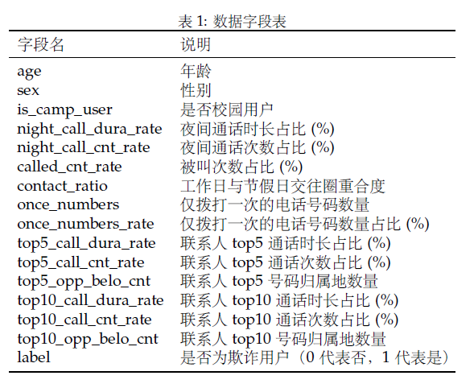
### 2.1 查看总体数据分布
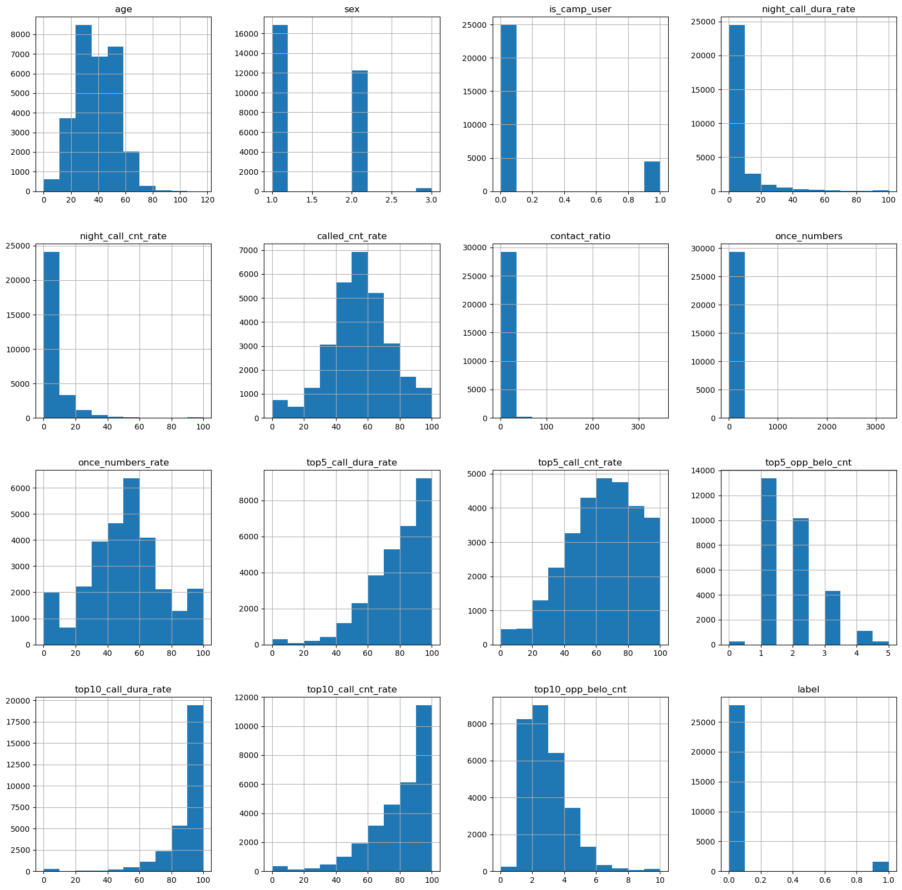
### 2.2 对比正常用户与欺诈用户的分布差异
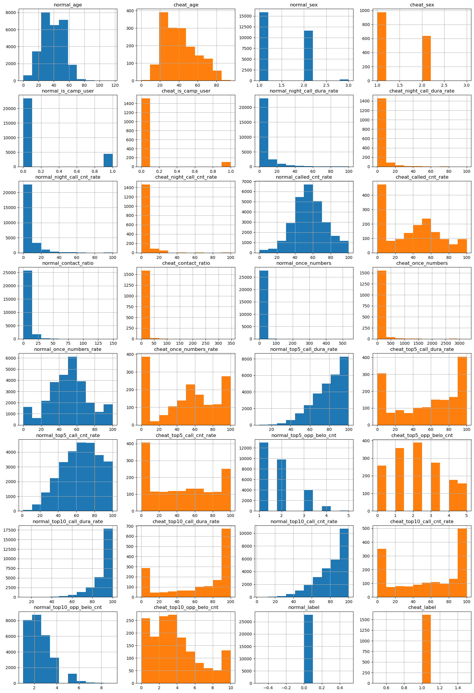
### 2.3 特征相关性分析
1. 查看各特征与label的相关系数的绝对值:  
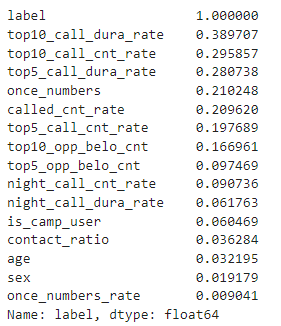
2. 查看特征之间的相关性  
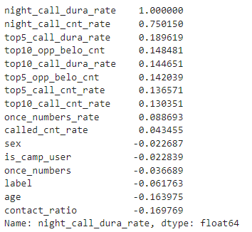    
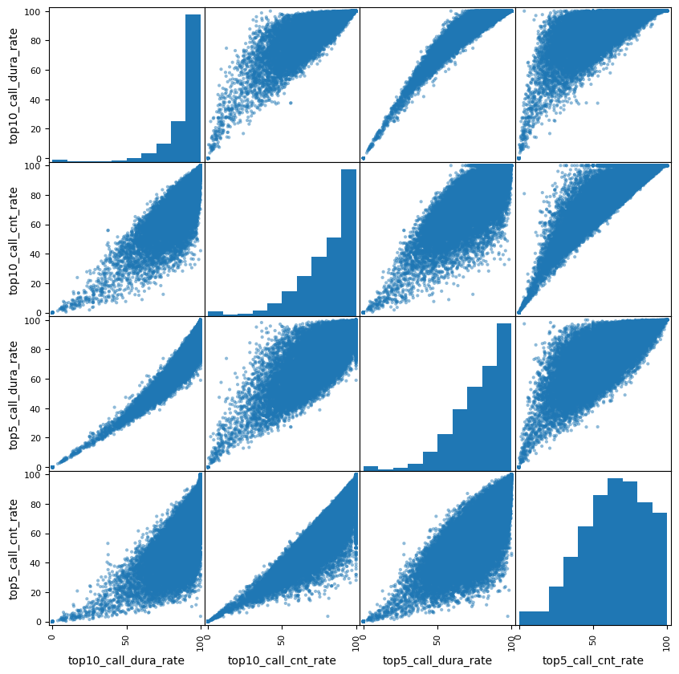
可以看到night_call_dura_rate与night_call_cnt_rate、 top5_call_dura_rate与top5_call_cnt_rate、top10_call_dura_rate与top10_call_cnt_rate相关性较高，需要进行处理；

### 2.3 结论
- 夜间通话时长/次数占比指标分布相似（相关性较高），考虑进行特征处理；
- top10的通话时长占比分布和次数占比分布相似，top10的通话时长占比分布与top5相似，但次数占比分布相似与top5不相似，考虑特征处理；
- 划分验证集时标签分层;

- 被呼叫次数偏低的那一部分是欺诈用户的可能性高；
- 仅拨打一次电话的数量比例分布呈现“W”形状，分布两头的部分可能是欺诈用户；
- 仅拨打一次电话的数量高于100的可能是欺诈用户；
- 联系人top5/10 通话时长占比(%)：较低那头是欺诈用户的可能性高;
- 联系人top5/10 通话次数占比(%)：较低那头是欺诈用户的可能性高;
- 联系人top5/10 号码归属地数量：归属地数量多的那部分是欺诈用户的可能性高;

## 3 数据准备
- 对rate去除%的单位影响：除100
- 对age做min-max归一化
- 对contact_ratio做min-max归一化
- 对号码归属地数量做min-max归一化
- 对once_numbers做min-max归一化

## 4 模型检索（使用默认超参数）
- 逻辑回归
- SVM分类
- 决策树
- 随机森林(bagging)
- XGBoost(boosting)
- LightGBM(boosting)

### 4.1 基学习器效果
- P-R曲线   
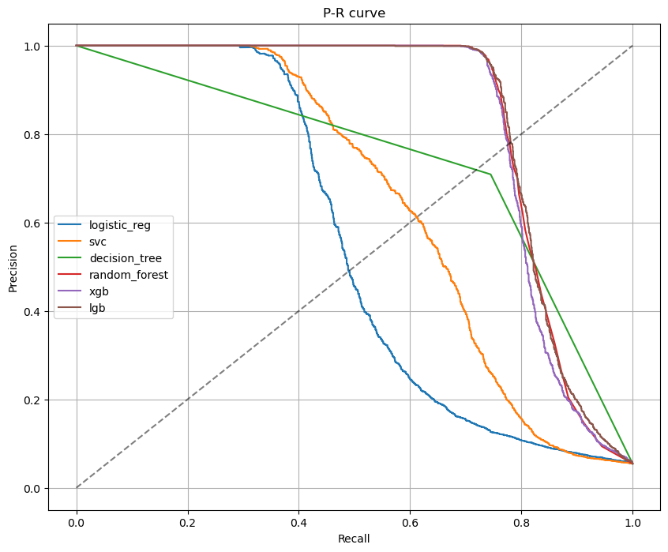
逻辑回归和svm可以直接淘汰，因为它俩被后面使用集成方法的模型完全包住；
- F2-score  
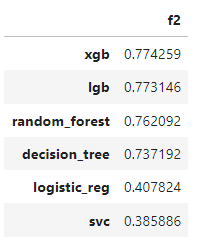

### 4.2 Soft-Voting
- f2-score角度  
使用GirdSearch寻找最佳的集成方案（以f2-score作为评估指标），最终找到最佳的集成方案为：决策树+随机森林+XGBoost+LightGBM
- P-R曲线角度  
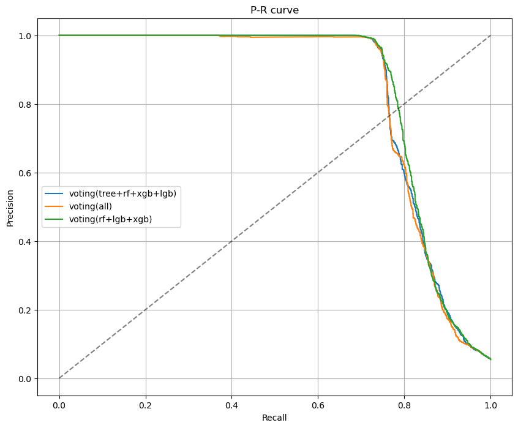
从P-R曲线上看似乎选随机森林+XGBoost+LightGBM也是不错的选择，不过本实验还是选择决策树+随机森林+XGBoost+LightGBM做集成

### 4.3 最终结果
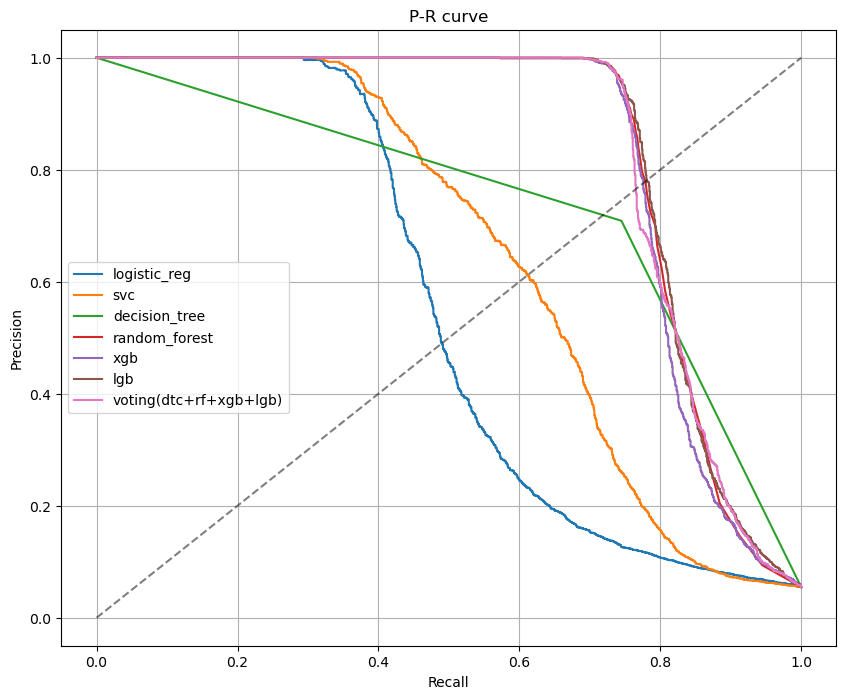
- 根据平衡点对各模型的排名:    
lgb > random_forest > xgb > voting > decision_tree > svc > logistic_reg

- 当precision设置为0.2时，recall的排名:   
decision_tree > lgb > voting > random_forest > xgb > svc > logistic_reg

最后选择lgb模型作为最终模型

## 5 微调
使用GridSearch(f2-score)寻找LightGBM的最佳超参数   
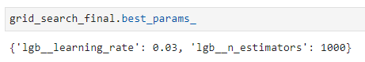

## 6 改进
1. 尝试丢弃共线性特征的方案；
2. 尝试丢弃贡献度不大的特征（根据random_forest的报告）

同样使用GridSearch(f2-score)寻找最佳方案
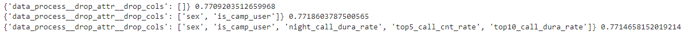    
可以看到仅删除低贡献属性的效果最好；    
无论是否都删除or只删除其中一个（共线性属性、低贡献属性）的效果比什么都不做好；  

## 7 评估
- f2-score  
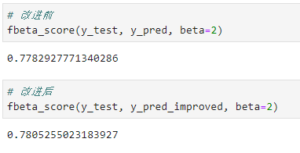    
- AUC  
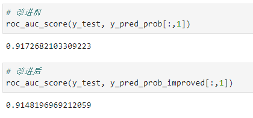    
- confusion_matrix  
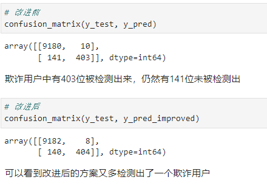    


### `1-7章具体内容还请详见NoteBook` 

## 8 一些需要注意的地方
1. 不要小看几百行的数据，删除它们可能会对任务造成毁灭性打击；
2. 在数据预处理的过程中尽量不要丢弃（行）数据，一方面，依据某一属性的取值丢弃行数据时，这些数据可能与label有重要联系；另一方面，训练时丢弃数据说明分类器无法处理此类型数据，在测试时也将无法处理此类型数据；
3. 关于Pipeline中的转换器，前一个转换器的输出如果是多个，将会以元组的形式传给到下一个转换器的第一个参数中；
4. 对于加入了预测器的pipeline，其fit(X, y)时只要求X经过转换器后shape与y匹配即可，但是如果将此pipeline丢入GridSearch，则在fit(X,y)时就要求X，y的shape匹配
5. 如果转换器不放在pipeline或者gridsearch里使用，可以任意自定义（不继承TransformerMixin、返回多个值等等）
6. 转换器最好依据本实验中的范式来写
    ```
    class KillPercentage(BaseEstimator, TransformerMixin):
        def __init__(self):
            return None
        
        def fit(self, X, y=None): # X, y两个参数
            return self # 什么都不做的话返回self
        
        def transform(self, X): # X一个参数
            res = X.copy()
            for col in res.columns:
                if 'rate' in col and 'avg' not in col:
                    res[col] = res[col]/100
            return res
    ```
7. 关于TransformerMixin自动生成的fit_transform()方法
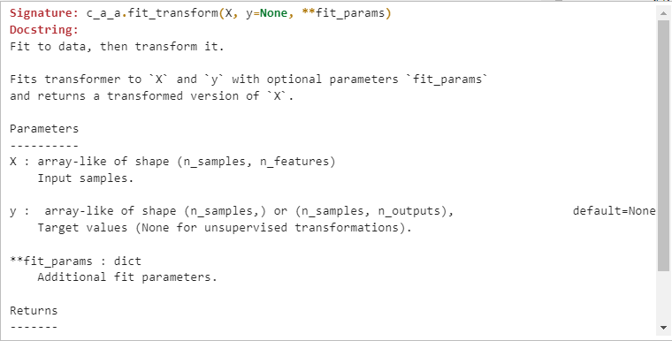    
最终仅返回transformed版本的X


